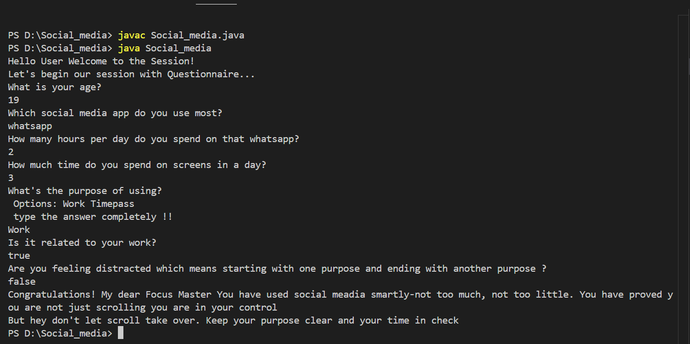
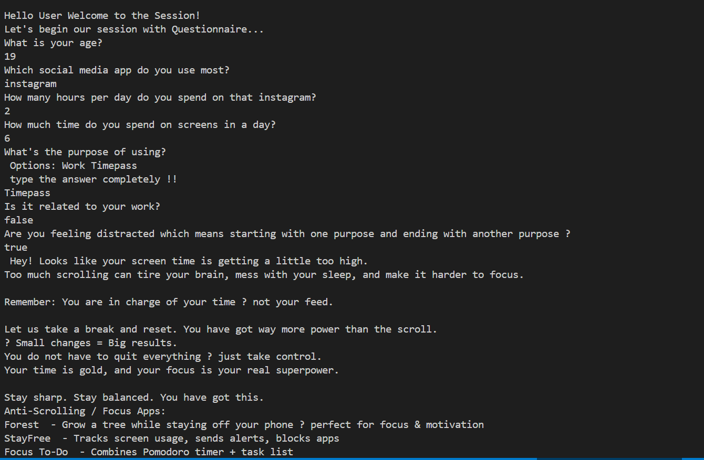
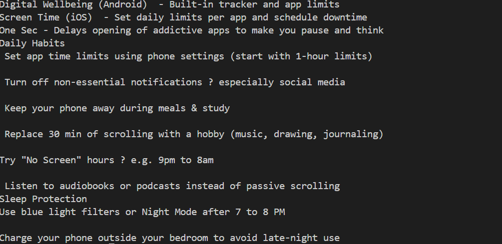

# Social-media-usage-analyzer
📱 Social Media Usage Analyzer A Java-based project designed to help users reflect on their screen time and understand how they interact with social media. It categorizes behavior by age group and user type (students, professionals, etc.) and provides personalized feedback, suggestions, and virtual badges to encourage mindful usage. 
🔍 Features
User questionnaire to collect usage data

Categorization by age and profession

Virtual badge system for healthy usage

Warnings and advice for overuse

Suggestions for focus & wellness apps

Motivational and awareness messages

🎯 Purpose
This project aims to promote digital well-being by helping users recognize and manage their social media habits effectively.

### 📸 Sample Output Screenshot

